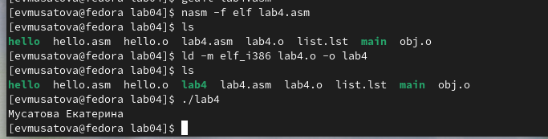

---
## Front matter
title: "Отчёт по лабораторной работе №4"
subtitle: "Дисциплина: архитектура компьютера"
author: "Мусатова Екатерина Викторовна"

## Generic otions
lang: ru-RU
toc-title: "Содержание"

## Bibliography
bibliography: bib/cite.bib
csl: pandoc/csl/gost-r-7-0-5-2008-numeric.csl

## Pdf output format
toc: true # Table of contents
toc-depth: 2
lof: true # List of figures
lot: true # List of tables
fontsize: 12pt
linestretch: 1.5
papersize: a4
documentclass: scrreprt
## I18n polyglossia
polyglossia-lang:
  name: russian
  options:
	- spelling=modern
	- babelshorthands=true
polyglossia-otherlangs:
  name: english
## I18n babel
babel-lang: russian
babel-otherlangs: english
## Fonts
mainfont: PT Serif
romanfont: PT Serif
sansfont: PT Sans
monofont: PT Mono
mainfontoptions: Ligatures=TeX
romanfontoptions: Ligatures=TeX
sansfontoptions: Ligatures=TeX,Scale=MatchLowercase
monofontoptions: Scale=MatchLowercase,Scale=0.9
## Biblatex
biblatex: true
biblio-style: "gost-numeric"
biblatexoptions:
  - parentracker=true
  - backend=biber
  - hyperref=auto
  - language=auto
  - autolang=other*
  - citestyle=gost-numeric
## Pandoc-crossref LaTeX customization
figureTitle: "Рис."
tableTitle: "Таблица"
listingTitle: "Листинг"
lofTitle: "Список иллюстраций"
lotTitle: "Список таблиц"
lolTitle: "Листинги"
## Misc options
indent: true
header-includes:
  - \usepackage{indentfirst}
  - \usepackage{float} # keep figures where there are in the text
  - \floatplacement{figure}{H} # keep figures where there are in the text
---

# Цель работы

Целью работы является освоение процедуры компиляции и сборки программ, написанных на ассемблере NASM.

# Выполнение лабораторной работы

**1**

Создаю каталог для работы с программами на языке ассамблера NASM

{#fig:001 width=70%}

**2**

Перехожу в созданный каталог

{#fig:001 width=70%}

**3**

Создаю текстовый файл с именем hello.asm

{#fig:001 width=70%}

**4**

Открываю созданный файл с помощью текстового редактора gedit и пишу нужный текст

{#fig:001 width=70%}

**5**

Превращаю текст программы «Hello World» в объектный код

{#fig:001 width=70%}

**6**

Проверяю что объектный файл бфл создан и называется htllo.o

{#fig:001 width=70%}

**7**

Компилирую исходный файл hello.asm в obg.o, а также создание файла list.lst

{#fig:001 width=70%}

**8**

Проверяю создание файлов

{#fig:001 width=70%}

**9**

Передаю объектный файл на обработку компоновщику

{#fig:001 width=70%}

**10**

Проверяю, что исполняемый файл hello был создан

{#fig:001 width=70%}

**11**

Задаю имя создаваемого исполняемого файла. Он будет иметь имя main, а объектный файл obj.o

{#fig:001 width=70%}

**12**

Запускаю на выполнение созданный исполняемый файл

{#fig:001 width=70%}

# Самостоятельная работа

**1**

В каталоге ~/work/arch-pc/lab04 с помощью команды cp создаю копию файла hello.asm с именем lab4.asm

{#fig:001 width=70%}

**2**

С помощью текстового редактора gedit вношу изменения в текст программы в файле lab4.asm так, чтобы вместо Hello world! на экран выводилась строка с моей фамилией и именем

{#fig:001 width=70%}

**3**

Оттранслирую полученный текст программы lab4.asm в объектный файл, затем выполняю компоновку объектного файла и запускаю получившийся исполняемый файл

{#fig:001 width=70%}

**4**

Копирую файлы hello.asm и lab4.asm в свой локальный репозиторий в каталог ~/work/study/2023-2024/"Архитектура компьютера"/arch-pc/labs/lab04/.

{#fig:001 width=70%}

**5**

Загружаю файлы на Github

{#fig:001 width=70%}

{#fig:001 width=70%}

# Выводы

В этой лабораторной работе я освоила процедуры компиляции и сборки программ, написанных на ассемблере NASM

::: {#refs}
:::
