---
## Front matter
title: "Отчёт по лабораторной работе №5"
subtitle: "Дисциплина: архитектура компьютера"
author: "Мусатова Екатерина Викторовна"

## Generic otions
lang: ru-RU
toc-title: "Содержание"

## Bibliography
bibliography: bib/cite.bib
csl: pandoc/csl/gost-r-7-0-5-2008-numeric.csl

## Pdf output format
toc: true # Table of contents
toc-depth: 2
lof: true # List of figures
lot: true # List of tables
fontsize: 12pt
linestretch: 1.5
papersize: a4
documentclass: scrreprt
## I18n polyglossia
polyglossia-lang:
  name: russian
  options:
	- spelling=modern
	- babelshorthands=true
polyglossia-otherlangs:
  name: english
## I18n babel
babel-lang: russian
babel-otherlangs: english
## Fonts
mainfont: PT Serif
romanfont: PT Serif
sansfont: PT Sans
monofont: PT Mono
mainfontoptions: Ligatures=TeX
romanfontoptions: Ligatures=TeX
sansfontoptions: Ligatures=TeX,Scale=MatchLowercase
monofontoptions: Scale=MatchLowercase,Scale=0.9
## Biblatex
biblatex: true
biblio-style: "gost-numeric"
biblatexoptions:
  - parentracker=true
  - backend=biber
  - hyperref=auto
  - language=auto
  - autolang=other*
  - citestyle=gost-numeric
## Pandoc-crossref LaTeX customization
figureTitle: "Рис."
tableTitle: "Таблица"
listingTitle: "Листинг"
lofTitle: "Список иллюстраций"
lotTitle: "Список таблиц"
lolTitle: "Листинги"
## Misc options
indent: true
header-includes:
  - \usepackage{indentfirst}
  - \usepackage{float} # keep figures where there are in the text
  - \floatplacement{figure}{H} # keep figures where there are in the text
---

# Цель работы

Цель данной лабораторной работы - приобретение практических навыков работы в Midnight Commander и освоение инструкций языка ассемблера mov и int.

# Выполнение лабораторной работы

Открываю Midnight Commander (рис. @fig:001).

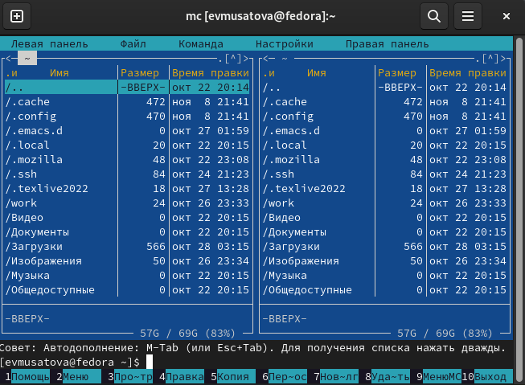{#fig:001 width=70%}

Пользуясь нужными клавишами, перехожу в каталог arch-pc (рис. @fig:002).

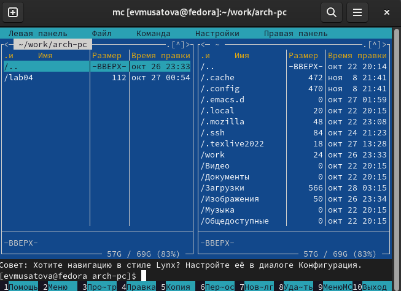{#fig:002 width=70%}

С помощью клавиши f7 создаю папку lab05 и прехожу в созданный каталог (рис. @fig:003).

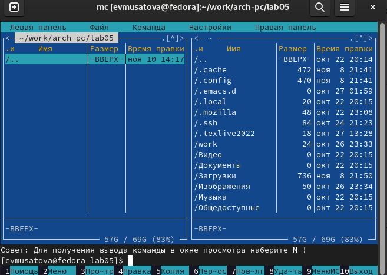{#fig:003 width=70%}

Пользуясь строкой ввода и командой touch создаю файл lab5-1.asm (рис. @fig:004).

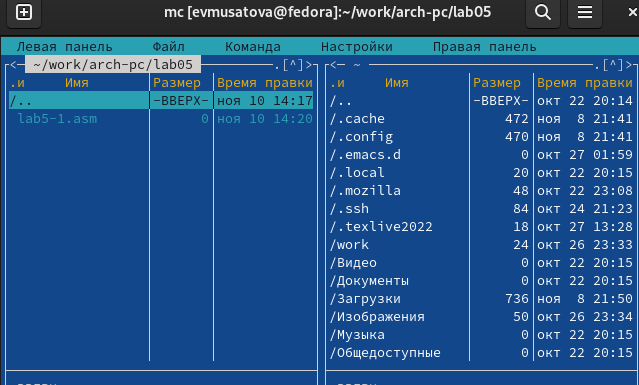{#fig:004 width=70%}

С помощью функциональной клавиши F4 открываю файл lab5-1.asm для редактирования во встроенном редакторе mcedit (рис. @fig:005).

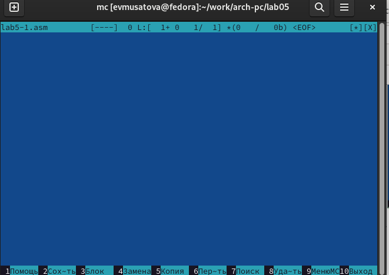{#fig:005 width=70%}

Ввожу текст программы из листинга 5.1 (рис. @fig:006). Затем сохраняю изменения и закрываю файл.

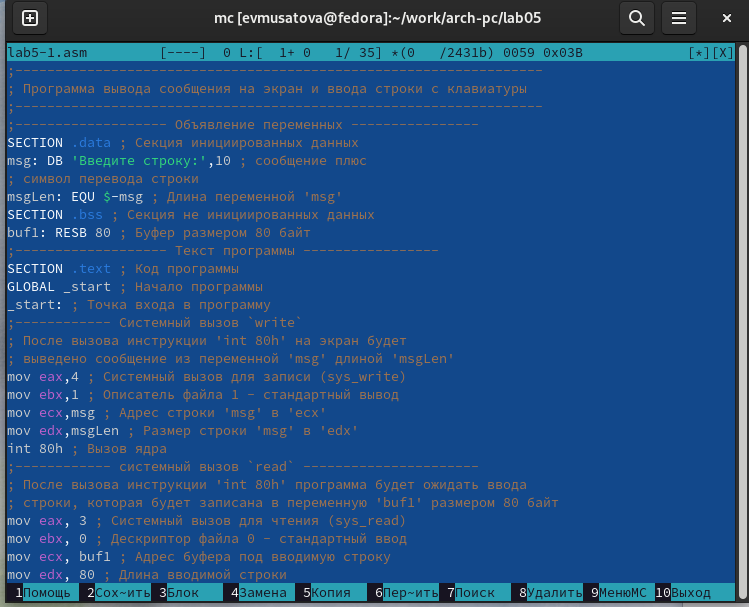{#fig:006 width=70%}

С помощью функциональной клавиши f3 открываю файл, чтобы убедиться, что он содержит текст программы (рис. @fig:007).

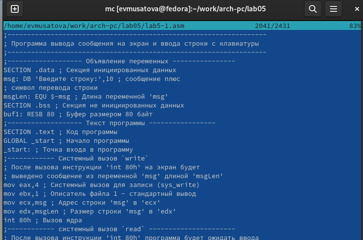{#fig:007 width=70%}

Оттранслировала текст программы lab5-1.asm в объектный файл, выполнила компоновку объектного файла и запустила получившийся исполняемый файл, на запрос ввела свою фамилию и имя  (рис. @fig:008).

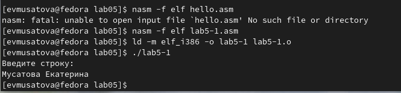{#fig:008 width=70%}

Скачиваю файл in_out.asm со страницы курса в ТУИС и помещаю его в тот же каталог, где находится файл с программой. Затем с помощью функциональной клавиши F6 создаю копию файла lab5-1.asm с именем lab5-2.asm. (рис. @fig:009).

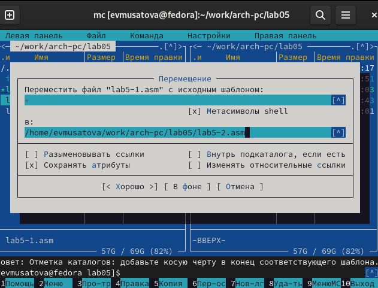{#fig:009 width=70%}

Исправляю текст программы в файле lab5-2.asm с использование подпрограмм из внешнего файла in_out.asm в соответствии с листингом 5.2 (рис. @fig:010).

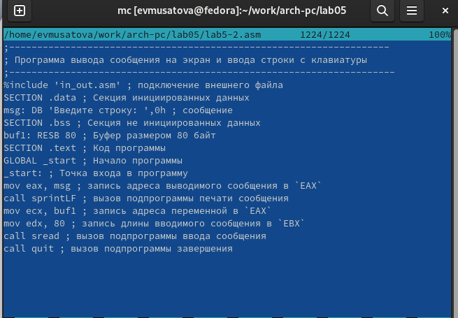{#fig:010 width=70%}

Создаю исполняемый файл и проверяю работу программы (рис. @fig:011).

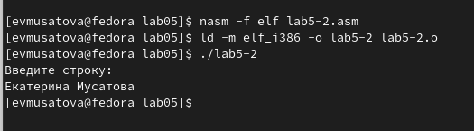{#fig:011 width=70%}

В файле lab5-2.asm заменяю подпрограмму sprintLF на sprint. Создаю исполняемый файл и проверяю его работу (рис. @fig:012). Разница заключается в том, что теперь ввод производится на той же строке, что и вывод, убран символ перевода строки после вывода.

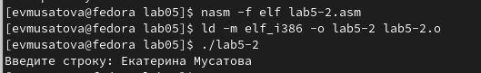{#fig:012 width=70%}

# Выполнение заданий для самостоятельной работы

1. Копирую файл lab5-1.asm с именем lab5-3.asm (рис. [-@fig:013]).

{ #fig:013 width=70% }

Изменяю код программы, добавляя вывод введенной строки (рис. [-@fig:014]).

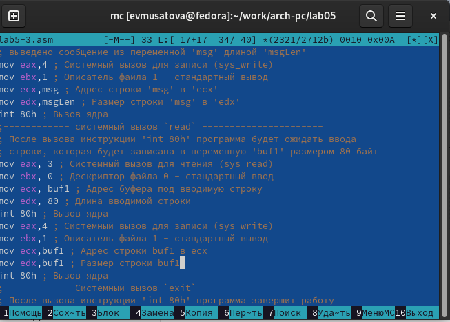{ #fig:014 width=70% }

Создаю объектный файл lab5-3.o и компоную его в исполняемый файл (рис. [-@fig:015]).

{ #fig:015 width=70% }

Запускаю программу и ввожу свуою фамилию для проверки (рис. [-@fig:016]).

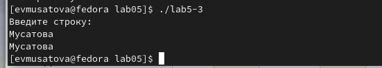{ #fig:016 width=70% }

Программа из пункта 1:

;------------------------------------------------------------------
; Программа вывода сообщения на экран и ввода строки с клавиатуры
;------------------------------------------------------------------
;------------------- Объявление переменных ----------------
SECTION .data ; Секция инициированных данных
msg: DB 'Введите строку:',10 ; сообщение плюс
; символ перевода строки
msgLen: EQU $-msg ; Длина переменной 'msg'
SECTION .bss ; Секция не инициированных данных
buf1: RESB 80 ; Буфер размером 80 байт
;------------------- Текст программы -----------------
SECTION .text ; Код программы
GLOBAL _start ; Начало программы
_start: ; Точка входа в программу
;------------ Cистемный вызов `write`
; После вызова инструкции 'int 80h' на экран будет
; выведено сообщение из переменной 'msg' длиной 'msgLen'
mov eax,4 ; Системный вызов для записи (sys_write)
mov ebx,1 ; Описатель файла 1 - стандартный вывод
mov ecx,msg ; Адрес строки 'msg' в 'ecx'
mov edx,msgLen ; Размер строки 'msg' в 'edx'
int 80h ; Вызов ядра
;------------ системный вызов `read` ----------------------
; После вызова инструкции 'int 80h' программа будет ожидать ввода
; строки, которая будет записана в переменную 'buf1' размером 80 байт
mov eax, 3 ; Системный вызов для чтения (sys_read)
mov ebx, 0 ; Дескриптор файла 0 - стандартный ввод
mov ecx, buf1 ; Адрес буфера под вводимую строку
mov edx, 80 ; Длина вводимой строки
int 80h ; Вызов ядра
mov eax,4 ; Системный вызов для записи (sys_write)
mov ebx,1 ; Описатель файла '1' - стандартный вывод
mov ecx,buf1 ; Адрес строки buf1 в ecx
mov edx,buf1 ; Размер строки buf1
int 80h ; Вызов ядра
;------------ Системный вызов `exit` ----------------------
; После вызова инструкции 'int 80h' программа завершит работу
mov eax,1 ; Системный вызов для выхода (sys_exit)
mov ebx,0 ; Выход с кодом возврата 0 (без ошибок)
int 80h ; Вызов ядра

2. Копирую файл lab5-2.asm с именем lab5-4.asm (рис. [-@fig:017]).

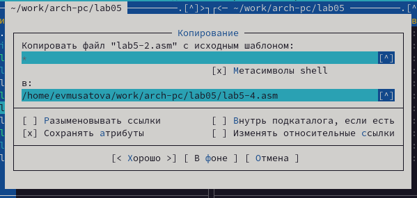{ #fig:017 width=70% }

Изменяю код программы, добавляя вывод введенной строки (рис. [-@fig:018]).

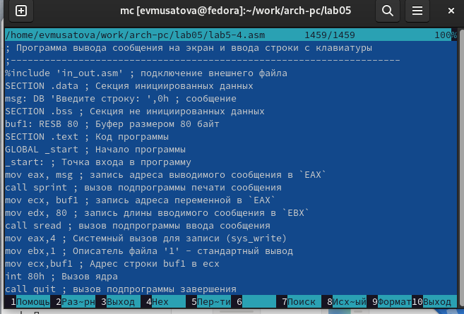{ #fig:018 width=70% }

Создаю исполняемый файл и запускаю его (рис. [-@fig:019]).

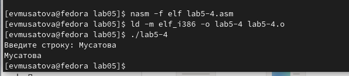{ #fig:019 width=70% }

Программа из пункта 2:

;--------------------------------------------------------------------
; Программа вывода сообщения на экран и ввода строки с клавиатуры
;---------------------------------------------------------------------
%include 'in_out.asm' ; подключение внешнего файла
SECTION .data ; Секция инициированных данных
msg: DB 'Введите строку: ',0h ; сообщение
SECTION .bss ; Секция не инициированных данных
buf1: RESB 80 ; Буфер размером 80 байт
SECTION .text ; Код программы
GLOBAL _start ; Начало программы
_start: ; Точка входа в программу
mov eax, msg ; запись адреса выводимого сообщения в `EAX`
call sprintLF ; вызов подпрограммы печати сообщения
mov ecx, buf1 ; запись адреса переменной в `EAX`
mov edx, 80 ; запись длины вводимого сообщения в `EBX`
call sread ; вызов подпрограммы ввода сообщения
mov eax,4 ; Системный вызов для записи (sys_write)
mov ebx,1 ; Описатель файла '1' - стандартный вывод
mov ecx,buf1 ; Адрес строки buf1 в ecx
int 80h ; Вызов ядра
call quit ; вызов подпрограммы завершения

# Выводы

Я приобрела практические навыки работы в Midnight Commander и освоила инструкции языка ассемблера mov и int.
