---
## Front matter
title: "Отчёт по лабораторной работе №6"
subtitle: "Дисциплина: архитектура компьютера"
author: "Мусатова Екатерина Викторовна"

## Generic otions
lang: ru-RU
toc-title: "Содержание"

## Bibliography
bibliography: bib/cite.bib
csl: pandoc/csl/gost-r-7-0-5-2008-numeric.csl

## Pdf output format
toc: true # Table of contents
toc-depth: 2
lof: true # List of figures
lot: true # List of tables
fontsize: 12pt
linestretch: 1.5
papersize: a4
documentclass: scrreprt
## I18n polyglossia
polyglossia-lang:
  name: russian
  options:
	- spelling=modern
	- babelshorthands=true
polyglossia-otherlangs:
  name: english
## I18n babel
babel-lang: russian
babel-otherlangs: english
## Fonts
mainfont: PT Serif
romanfont: PT Serif
sansfont: PT Sans
monofont: PT Mono
mainfontoptions: Ligatures=TeX
romanfontoptions: Ligatures=TeX
sansfontoptions: Ligatures=TeX,Scale=MatchLowercase
monofontoptions: Scale=MatchLowercase,Scale=0.9
## Biblatex
biblatex: true
biblio-style: "gost-numeric"
biblatexoptions:
  - parentracker=true
  - backend=biber
  - hyperref=auto
  - language=auto
  - autolang=other*
  - citestyle=gost-numeric
## Pandoc-crossref LaTeX customization
figureTitle: "Рис."
listingTitle: "Листинг"
lofTitle: "Список иллюстраций"
lolTitle: "Листинги"
## Misc options
indent: true
header-includes:
  - \usepackage{indentfirst}
  - \usepackage{float} # keep figures where there are in the text
  - \floatplacement{figure}{H} # keep figures where there are in the text
---

# Цель работы

Цель данной лабораторной работы - освоение арифметческих инструкций языка ассемблера NASM.

# Выполнение лабораторной работы

**1**

Создайте каталог для программ лабораторной работы № 6, перехожув него и создаю файл lab6-1.asm     (рис. @fig:001).

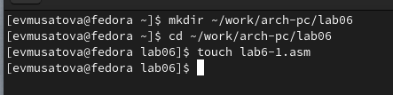{#fig:001 width=70%}

**2**

Ввожу в файл lab6-1.asm текст программы из листинга 6.1 (рис. @fig:002).

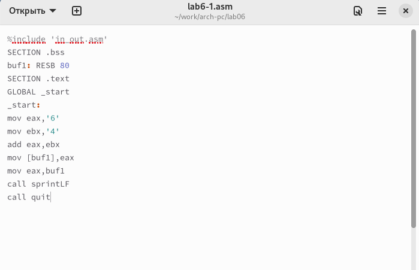{#fig:002 width=70%}

Создаю исполняемы файл и запускаю его для проверки программы и вижу, что выводится символ j (рис. @fig:003).

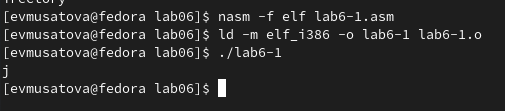{#fig:003 width=70%}

**3**

Исправляю текст программы из листинга 6.1, заменяя символы "6" и "4" на цифры 6 и 4 (рис. @fig:004).

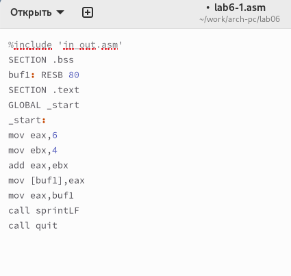{#fig:004 width=70%}

Создаю исполняемый файл и запускаю его (рис. @fig:005). Теперь вывелся символ с кодом 10, это символ перевода строки, он не отображается при выводе на экран.

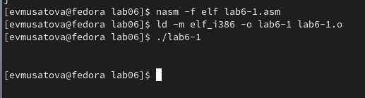{#fig:005 width=70%}

**4**

Создаю файл lab6-2.asm в каталоге lab06 (рис. @fig:006).

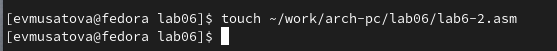{#fig:006 width=70%}

Ввожу в созданный файл текст программы из листинга 6.2 (рис. @fig:007).

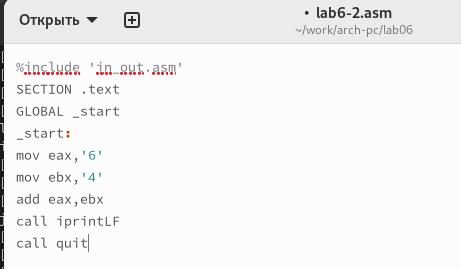{#fig:007 width=70%}

Создаю исполняемый файл и запускаю его (рис. @fig:008). Теперь выводится число 106, потому что программа позволяет вывести именно число, а не символ, хотя все еще происходит именно сложение кодов символов "6" и "4".

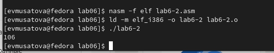{#fig:008 width=70%}

**5**

Аналогично предыдущему примеру изменяю символы на числа (рис. @fig:009).

{#fig:009 width=70%}

Создаю исполняемый файл и запускаю его (рис. @fig:010). Теперь программа складывает не соответствующие символам коды в системе ASCII, а сами числа, поэтому вывод 10.

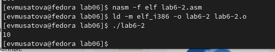{#fig:010 width=70%}

Заменяю функцию iprintLF на iprint (рис. @fig:011).

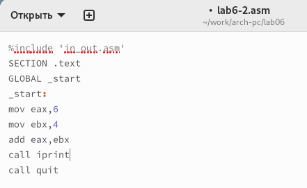{#fig:011 width=70%}

Создаю исполняемый файл и запускаю его (рис. @fig:012).Теперь функция iprint добавляет к выводу символ переноса строки, в отличие от iprintLF.

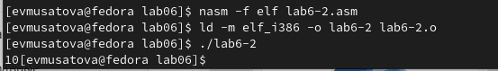{#fig:012 width=70%}

**6**

Создаю файл lab6-3 (рис. @fig:013).

{#fig:013 width=70%}

Ввожу в текст программы из листинга 6.3 в созданный файл. Затем создаю исполняемый файл и проверяю работу программы (рис. @fig:014).

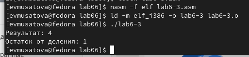{#fig:014 width=70%}

Изменяю текст программы для вычисления выражения 𝑓(𝑥) = (4 ∗ 6 + 2)/5 (рис. @fig:015).

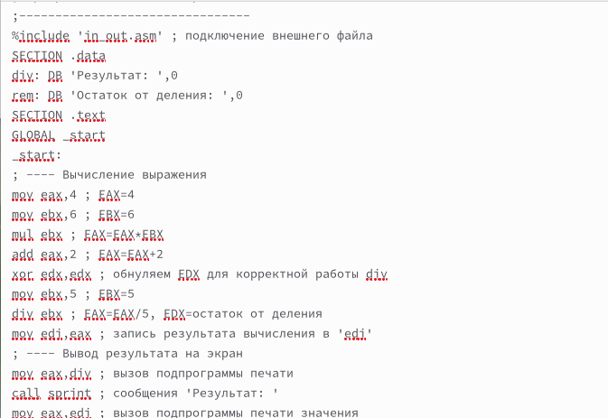{#fig:015 width=70%}

Создаю исполняемый файл и проверяю его работу (рис. @fig:016).

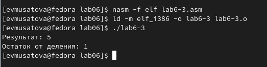{#fig:016 width=70%}

**7**

Создаю файл variant.asm в каталоге lab06 (рис. @fig:017).

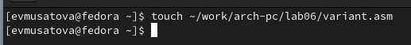{#fig:017 width=70%}

Ввожу текст программы из листинга 6.4 (рис. @fig:018).

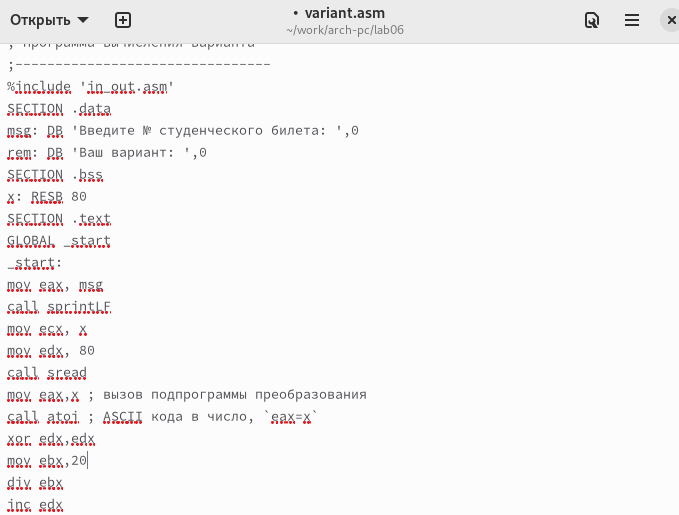{#fig:018 width=70%}

Создаю исполняемый файл и запускаю его, затем ввожу номер студенческого билета и узнаю номер своего варианта (рис. @fig:019).

{#fig:019 width=70%}

# Ответы на вопросы по программе

1. За вывод сообщения "Ваш вариант" отвечают строки кода:

mov eax,rem
call sprint

2. Инструкция mov ecx, x используется, чтобы положить адрес вводимой строки x в регистр ecx.
Mov edx, 80 - запись в регистр edx длины вводимой строки.
Call sread - вызов подпрограммы из внешнего файла, обеспечивающей ввод сообщения с клавиатуры.

3. Инструкция call atoi используется для вызова подпрограммы из внешнего файла, которая преобразует ascii-код символа в целое число и записывает результат в регистр eax

4. За вычисления варианта отвечают строки:

xor edx,edx ; обнуление edx для корректной работы div
mov ebx,20 ; ebx = 20
div ebx ; eax = eax/20, edx - остаток от деления
inc edx ; edx = edx + 1

5. При выполнении инструкции div ebx остаток от деления записывается в регистр edx

6. Инструкция inc edx увеличивает значение регистра edx на 1

7. За вывод на экран результатов вычислений отвечают строки:

mov eax,edx
call iprintLF

# Самостоятельная работа

Создаю файл lab6-4 (рис. @fig:020).

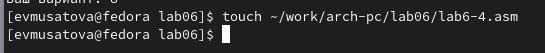{#fig:020 width=70%}

Открываю созданный файл, ввожу в него текст программы для вычисления значения выражения (11 + x) * 2 - 6 (рис. @fig:021). Это выражение было под вариантом 8, который мне достался.

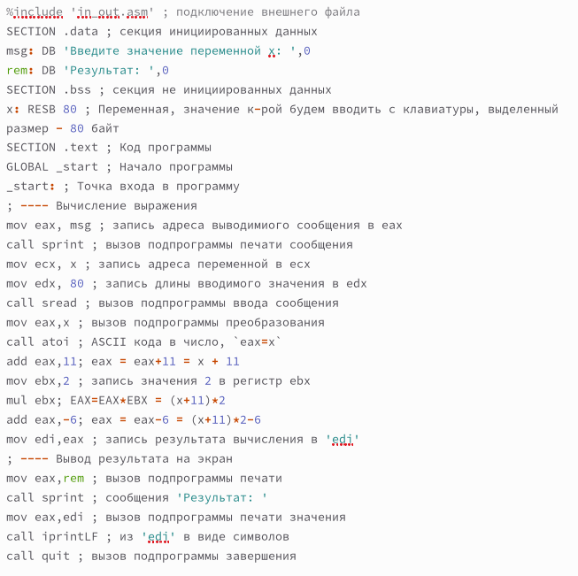{#fig:021 width=70%}

Создаю исполняемый файл (рис. @fig:022).

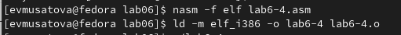{#fig:022 width=70%}

Запускаю исполняемый файл, ввожу значение - 1, при выводе получаю - 18 (рис. @fig:023).

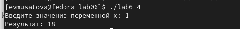{#fig:023 width=70%}

Запускаю исполняемый файл, теперь ввожу значение - 9, при выводе получаю - 34 (рис. @fig:024).

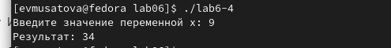{#fig:024 width=70%}

# Листинг 6.5. Программа для вычисления значения выражения (11 + x) * 2 − 6.

%include 'in_out.asm' ; подключение внешнего файла
SECTION .data ; секция инициированных данных
msg: DB 'Введите значение переменной х: ',0
rem: DB 'Результат: ',0
SECTION .bss ; секция не инициированных данных
x: RESB 80 ; Переменная, значение к-рой будем вводить с клавиатуры, выделенный размер - 80 байт
SECTION .text ; Код программы
GLOBAL _start ; Начало программы
_start: ; Точка входа в программу
; ---- Вычисление выражения
mov eax, msg ; запись адреса выводимиого сообщения в eax
call sprint ; вызов подпрограммы печати сообщения
mov ecx, x ; запись адреса переменной в ecx
mov edx, 80 ; запись длины вводимого значения в edx
call sread ; вызов подпрограммы ввода сообщения
mov eax,x ; вызов подпрограммы преобразования
call atoi ; ASCII кода в число, `eax=x`
add eax,11; eax = eax+11 = x + 11
mov ebx,2 ; запись значения 2 в регистр ebx
mul ebx; EAX=EAX*EBX = (x+11)*2
add eax,-6; eax = eax-6 = (x+11)*2-6
mov edi,eax ; запись результата вычисления в 'edi'
; ---- Вывод результата на экран
mov eax,rem ; вызов подпрограммы печати
call sprint ; сообщения 'Результат: '
mov eax,edi ; вызов подпрограммы печати значения
call iprintLF ; из 'edi' в виде символов
call quit ; вызов подпрограммы завершения

# Выводы

При выполнении данной лабораторной работы я освоила арифметические инструкции языка ассемблера NASM.

