---
## Front matter
title: "Лабораторная работа №7"
subtitle: "Дисциплина: архитектура компьютера"
author: "Мусатова Екатерина Викторовна"

## Generic otions
lang: ru-RU
toc-title: "Содержание"

## Bibliography
bibliography: bib/cite.bib
csl: pandoc/csl/gost-r-7-0-5-2008-numeric.csl

## Pdf output format
toc: true # Table of contents
toc-depth: 2
lof: true # List of figures
lot: true # List of tables
fontsize: 12pt
linestretch: 1.5
papersize: a4
documentclass: scrreprt
## I18n polyglossia
polyglossia-lang:
  name: russian
  options:
	- spelling=modern
	- babelshorthands=true
polyglossia-otherlangs:
  name: english
## I18n babel
babel-lang: russian
babel-otherlangs: english
## Fonts
mainfont: PT Serif
romanfont: PT Serif
sansfont: PT Sans
monofont: PT Mono
mainfontoptions: Ligatures=TeX
romanfontoptions: Ligatures=TeX
sansfontoptions: Ligatures=TeX,Scale=MatchLowercase
monofontoptions: Scale=MatchLowercase,Scale=0.9
## Biblatex
biblatex: true
biblio-style: "gost-numeric"
biblatexoptions:
  - parentracker=true
  - backend=biber
  - hyperref=auto
  - language=auto
  - autolang=other*
  - citestyle=gost-numeric
## Pandoc-crossref LaTeX customization
figureTitle: "Рис."
tableTitle: "Таблица"
listingTitle: "Листинг"
lofTitle: "Список иллюстраций"
lotTitle: "Список таблиц"
lolTitle: "Листинги"
## Misc options
indent: true
header-includes:
  - \usepackage{indentfirst}
  - \usepackage{float} # keep figures where there are in the text
  - \floatplacement{figure}{H} # keep figures where there are in the text
---

# Цель работы

Изучить команды условного и безусловного переходов и научиться писать программы с использованием этих переходов.

# Выполнение лабораторной работы

**1**

Создаю каталог для лабораторной работы № 7, перехожу в него и создаю файл lab7-1.asm (рис. @fig:001).

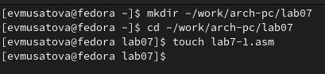{#fig:001 width=70%}

**2**

Ввожу в файл lab7-1.asm текст программы из листинга 7.1 (рис. @fig:002).

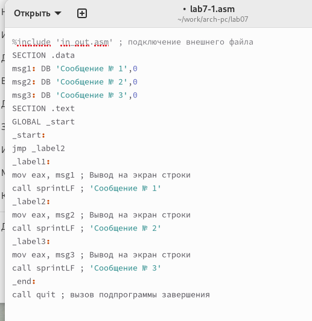{#fig:002 width=70%}

Создаю исполняемый файл и проверяю правильность работы программы (рис. @fig:003).

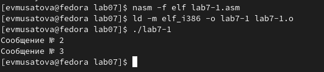{#fig:003 width=70%}

Изменим программу таким образом, чтобы она выводила сначала ‘Сообщение № 2’, потом ‘Сообщение № 1’ и завершала работу в соответствии с листингом 7.2 (рис. @fig:004).

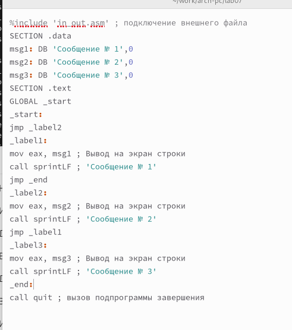{#fig:004 width=70%}

Создаю исполняемый файл и проверяю работу программы (рис. @fig:005).

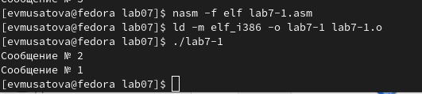{#fig:005 width=70%}

Изменяю текст программы добавляя и изменяя инструкции jmp (рис. @fig:006).

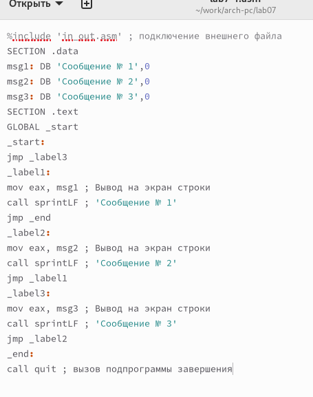{#fig:006 width=70%}

Создаю исполняемый файл и проверяю работу программы (рис. @fig:007).

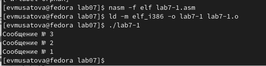{#fig:007 width=70%}

**3**

Создаю файл lab7-2.asm (рис. @fig:008).

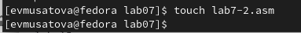{#fig:008 width=70%}

В созданный файл ввожу текст из листинга 7.3 (рис. @fig:009).

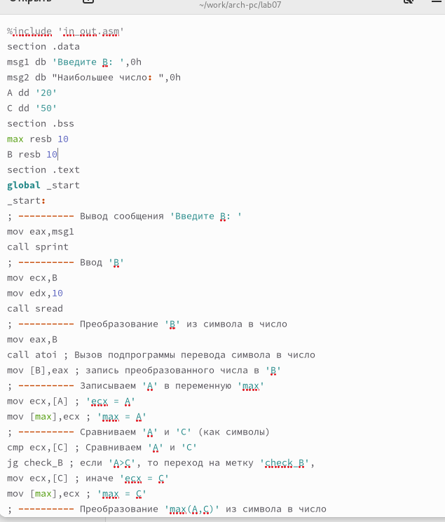{#fig:009 width=70%}

Создаю исполняемый файл и проверяю его работу для разных значений B (рис. @fig:010).

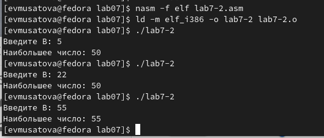{#fig:010 width=70%}

**4**

Создаю файл листинга для программы из файла lab7-2.asm (рис. @fig:011).

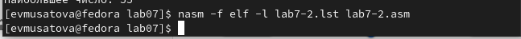{#fig:011 width=70%}

Открываю файл листинга с помощью текстового редактора mcedit (рис. @fig:012). В строке 9 содержится номер сторки [8], адресс [00000003], машинный код [803800] и содержимое строки кода [cmp byte [eax], 0] в строке 11 содержится номер сторки [10], адресс [00000008], машинный код [40] и содержимое строки кода [inc eax] в строке 24 содержится номер сторки [23], адрес [0000000F], машинный код [52] и содержимое строки кода [push edx].

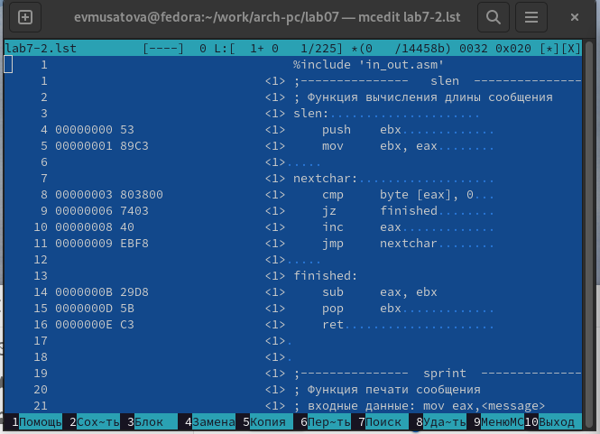{#fig:012 width=70%}

Открываю файл с программой lab7-2.asm и в инструкции с двумя операндами удаляю операнд B (рис. @fig:013).

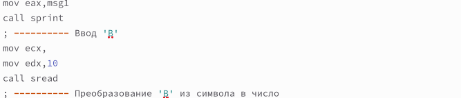{#fig:013 width=70%}

Выполняю трансляцию с получением файла листинга (рис. @fig:014).

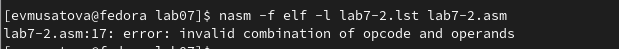{#fig:014 width=70%}

Проверяю файл листинга и вижу, что если в коде появляется ошибка, то ее описание появится в файле листинга (рис. @fig:015).

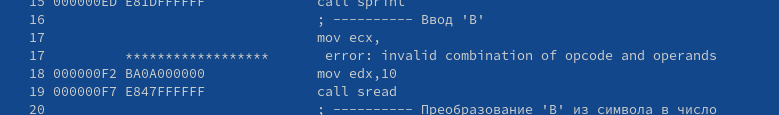{#fig:015 width=70%}

# Самостоятельная работа

Создаю файл lab7-3 и пишу программу из 3 целочисленных переменных A,B и С в соответствии с 8 вариантом (рис. @fig:016).

![Написание программы(image/16.png){#fig:016 width=70%}

Создаю исполняемый файл и проверяю работу программы (рис. @fig:017).

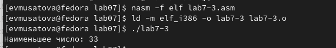{#fig:017 width=70%}

Создаю файл lab7-4 и пишу программу, которая для введенных с клавиатуры значений 𝑥 и 𝑎 вычисляет
значение заданной функции из варианта 8  (рис. @fig:018).

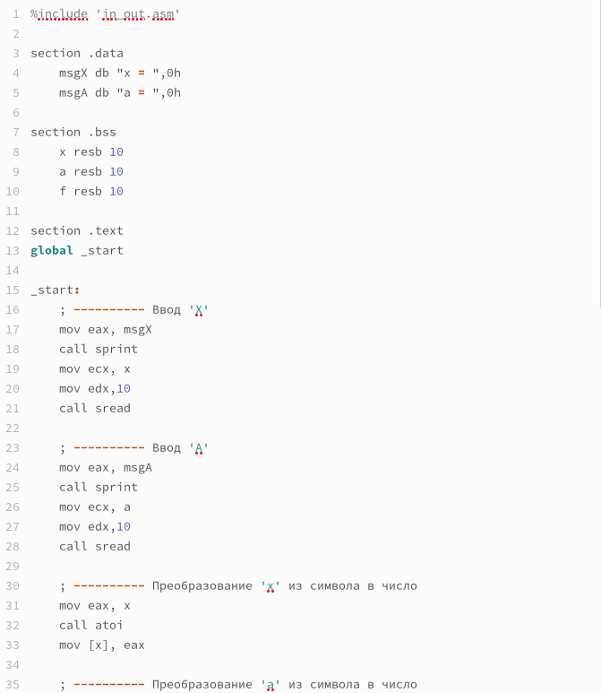{#fig:018 width=70%}

Создаю исполняемый файл и проверяю работу программы (рис. @fig:019).

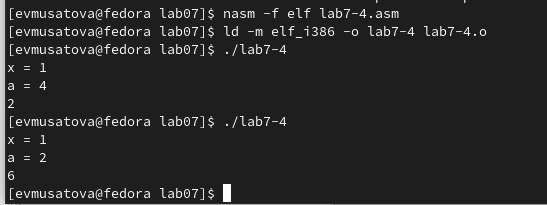{#fig:019 width=70%}

**Листинг к заданию 1**

%include 'in_out.asm'
section .data
    msg1 db "Наименьшее число: ",0h
    a dd 33
    b dd 40
    c dd 52
section .bss
    min resb 10
section .text
global _start
_start:
    mov ecx, [a]
    mov [min], ecx ; 'min = A'
    ; ---------- Сравниваем 'A' и 'С' (как числа)
    cmp ecx, [c] ; Сравниваем 'A' и 'С'
    jl check_B ; если 'A<C', то переход на метку 'check_B',
    mov ecx, [c] ; иначе 'ecx = C'
    mov [min], ecx ; 'min = C'
; ---------- Преобразование 'min(A,C)' из символа в число
check_B:
    ; ---------- Сравниваем 'min(A,C)' и 'B' (как числа)
    mov ecx, [min]
    cmp ecx, [b] ; Сравниваем 'min(A,C)' и 'B'
    jl fin ; если 'min(A,C)>B', то переход на 'fin',
    mov ecx, [b] ; иначе 'ecx = B'
    mov [min], ecx
; ---------- Вывод результата
fin:
    mov eax, msg1
    call sprint
    mov eax,[min]
    call iprintLF ; Вывод 'min(A,B,C)'
    call quit ; Выход
    
    **Листинг к заданию 2**
    
 %include 'in_out.asm'

section .data
    msgX db "x = ",0h
    msgA db "a = ",0h

section .bss
    x resb 10
    a resb 10
    f resb 10

section .text
global _start

_start:
    ; ---------- Ввод 'X'
    mov eax, msgX
    call sprint
    mov ecx, x
    mov edx,10
    call sread

    ; ---------- Ввод 'A'
    mov eax, msgA
    call sprint
    mov ecx, a
    mov edx,10
    call sread

    ; ---------- Преобразование 'x' из символа в число
    mov eax, x
    call atoi
    mov [x], eax

    ; ---------- Преобразование 'a' из символа в число
    mov eax, a
    call atoi
    mov [a], eax

    mov ecx, [a]
    cmp ecx, 3  ;сравниваем а и цифру 3

    ja newfunc ;если а больше то идем по метке

    mov eax, [a] ;иначе а умножаем на 3
    mov ebx, 3
    mul ebx
    jmp fin

newfunc:
    mov eax, [x]
    mov ebx, 1
    add eax, ebx

fin:
    call iprintLF 
    call quit   

# Выводы

Я изучила команды условного и безусловного переходов и научилась писать программы с использованием этих переходов.

