---
## Front matter
title: "Отчёт по лабораторной работе № 9"
subtitle: "Дисциплина: архитектура компьютера"
author: "Мусатова Екатерина Викторовна"

## Generic otions
lang: ru-RU
toc-title: "Содержание"

## Bibliography
bibliography: bib/cite.bib
csl: pandoc/csl/gost-r-7-0-5-2008-numeric.csl

## Pdf output format
toc: true # Table of contents
toc-depth: 2
lof: true # List of figures
lot: true # List of tables
fontsize: 12pt
linestretch: 1.5
papersize: a4
documentclass: scrreprt
## I18n polyglossia
polyglossia-lang:
  name: russian
  options:
	- spelling=modern
	- babelshorthands=true
polyglossia-otherlangs:
  name: english
## I18n babel
babel-lang: russian
babel-otherlangs: english
## Fonts
mainfont: PT Serif
romanfont: PT Serif
sansfont: PT Sans
monofont: PT Mono
mainfontoptions: Ligatures=TeX
romanfontoptions: Ligatures=TeX
sansfontoptions: Ligatures=TeX,Scale=MatchLowercase
monofontoptions: Scale=MatchLowercase,Scale=0.9
## Biblatex
biblatex: true
biblio-style: "gost-numeric"
biblatexoptions:
  - parentracker=true
  - backend=biber
  - hyperref=auto
  - language=auto
  - autolang=other*
  - citestyle=gost-numeric
## Pandoc-crossref LaTeX customization
figureTitle: "Рис."
tableTitle: "Таблица"
listingTitle: "Листинг"
lofTitle: "Список иллюстраций"
lotTitle: "Список таблиц"
lolTitle: "Листинги"
## Misc options
indent: true
header-includes:
  - \usepackage{indentfirst}
  - \usepackage{float} # keep figures where there are in the text
  - \floatplacement{figure}{H} # keep figures where there are in the text
---

# Цель работы

Освоить работу с подпрограммами и отладчиком gdb.

# Выполнение лабораторной работы

Создаю необходимый каталог и файлы (рис. @fig:001).

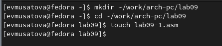{#fig:001 width=70%}

Ввожу в файл lab09-1.asm текст программы из листинга 9.1. Создаю исполняемый файл и проверяю его работу (рис. @fig:002).

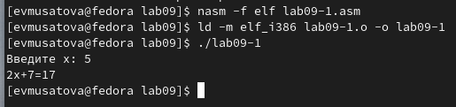{#fig:002 width=70%}

Добавляю подпрограмму _subcalcul в подпрограмму _calcul, для вычисления выражения 𝑓(𝑔(𝑥)), (рис. @fig:003).

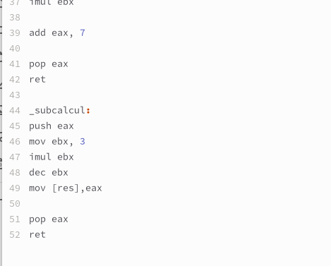{#fig:003 width=70%}

Создаю исполняемый файл и проверяю работу программы (рис. @fig:004).

{#fig:004 width=70%}

Создаю файл lab09-2.asm с текстом программы из Листинга 9.2. Затем получаю исполняемый файл и загружаю его в отладчик gdb (рис. @fig:005).

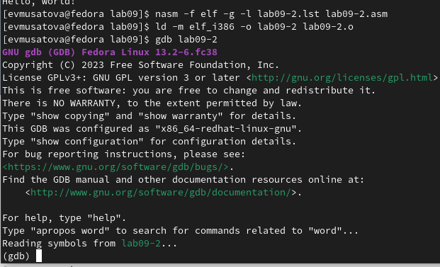{#fig:005 width=70%}

Запускакю программу в оболочке GDB с помощью команды run (рис. @fig:006).

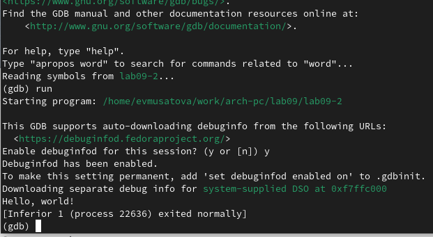{#fig:006 width=70%}

Для более подробного анализа программы устанавливаю брейкпоинт на метку _start, с которой начинается выполнение любой ассемблерной программы, и запускаю её (рис. @fig:007).

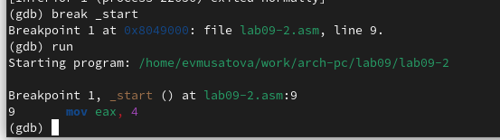{#fig:007 width=70%}

Смотрю дисассимилированный код программы с помощью команды disassemble (рис. @fig:008).

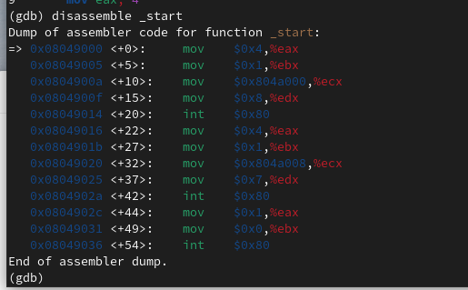{#fig:008 width=70%}

Переключаюсь на отображение команд с Intel’овским синтаксисом (рис. @fig:009). В представлении ATT в виде 16-ричного числа записаны первые аргументы всех комманд, а в представлении intel так записываются адреса вторых аргумантов.

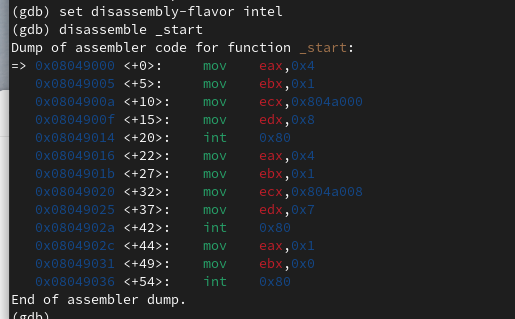{#fig:009 width=70%} 

Включаю режим псевдографики  (рис. @fig:010).

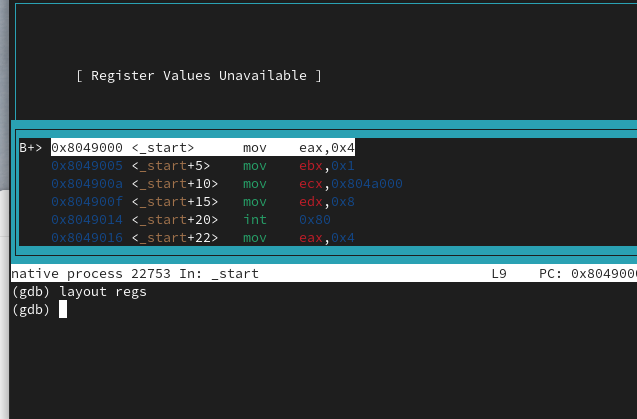{#fig:010 width=70%}

Проверяю что была установлена точка основа. Затем устанавливаю еще одну точку основа по адресу инструкции (рис. @fig:011).

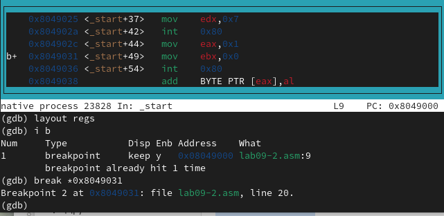{#fig:011 width=70%}

Смотрю информацию о всех установленных точках основа  (рис. @fig:012).

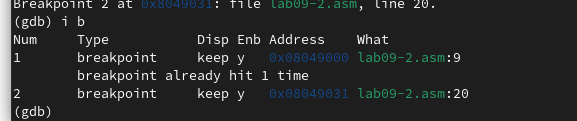{#fig:012 width=70%}

Выполняю 5 инструкций  (рис. @fig:013).

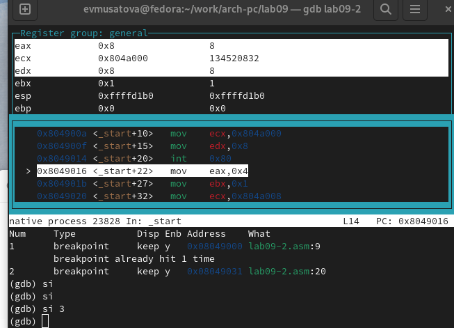{#fig:013 width=70%}

Смотрю значение переменной по имени (рис. @fig:014).

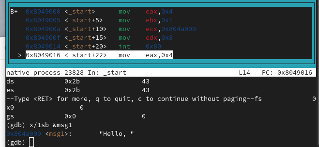{#fig:014 width=70%}

Теперь смотрю значение переменной по адресу (рис. @fig:015).

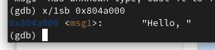{#fig:015 width=70%}

Изменяю первый символ переменной msg1 (рис. @fig:016).

{#fig:016 width=70%}

Теперь заменяю символ во второй переменной (рис. @fig:017).

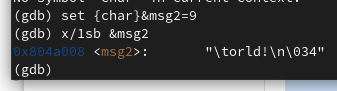{#fig:017 width=70%}

С помощью команды set изменяю значение регистра ebx (рис. @fig:018). Однако при попытке задать строчное значение, происходит ошибка.

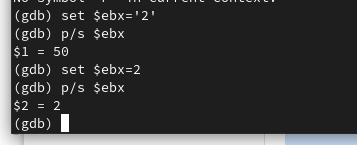{#fig:018 width=70%}

Завершаю выполнение программы (рис. @fig:019).

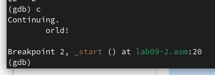{#fig:019 width=70%}

Копирую файл lab8-2.asm, созданный при выполнении лабораторной работы №8, создаю исполняемый файл и загружаю его в отладчик, указав аргументы (рис. @fig:020).

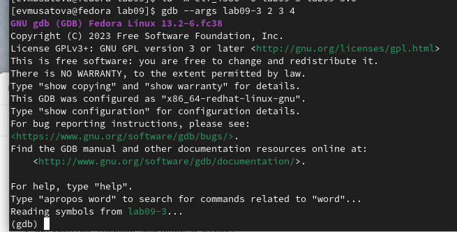{#fig:020 width=70%}

Для начала установим точку останова перед первой инструкцией в программе и запустим её (рис. @fig:021).

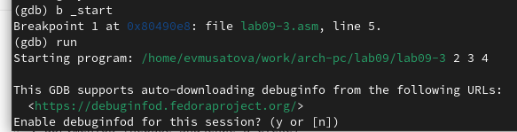{#fig:021 width=70%}

Смотрим количество аргументов (рис. @fig:022).

{#fig:022 width=70%}

Смотрю остальные позиции стека (рис. @fig:023). Их адреса распологаются в 4 байтах друг от друга(именно столько заниемает элемент стека.

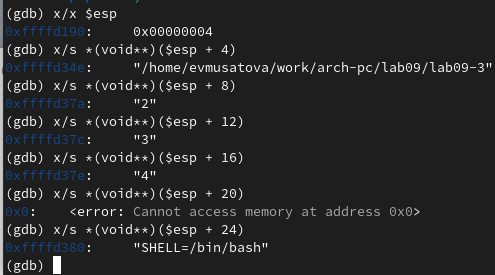{#fig:023 width=70%}

# Выводы

В результате выполнения работы, я научился организовывать код в подпрограммы и познакомился с базовыми функциями отладчика gdb.

